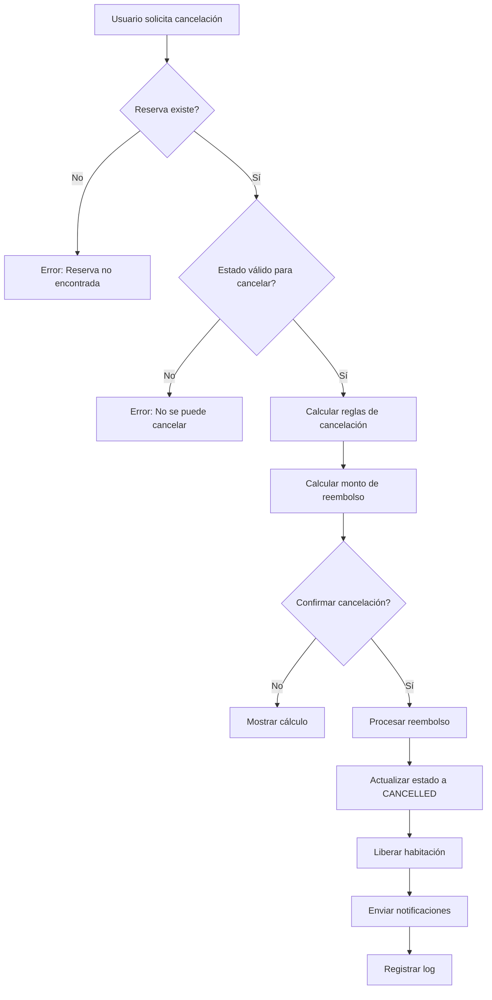
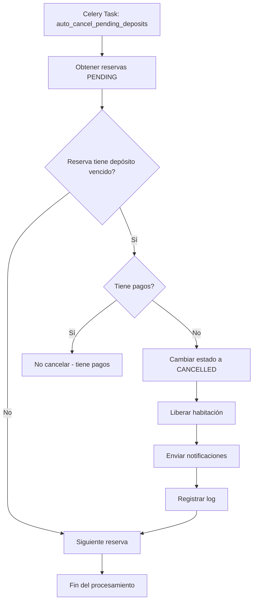
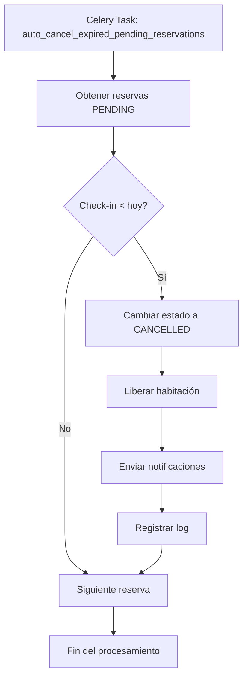
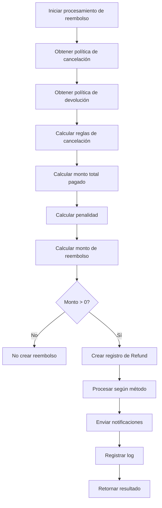
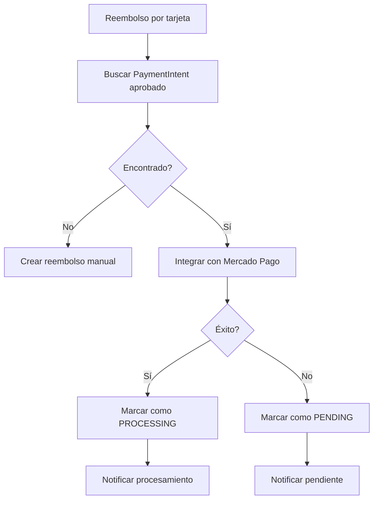
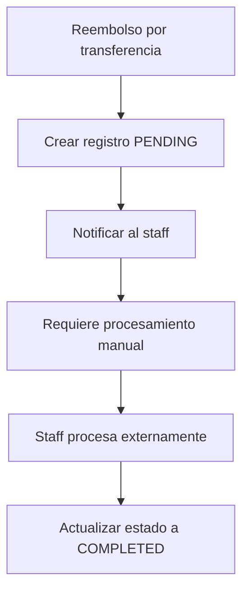
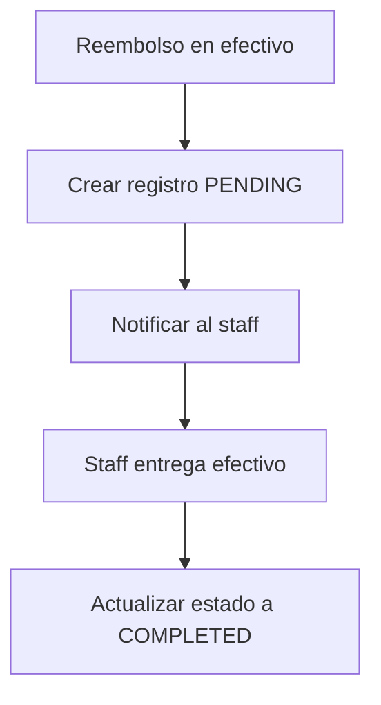
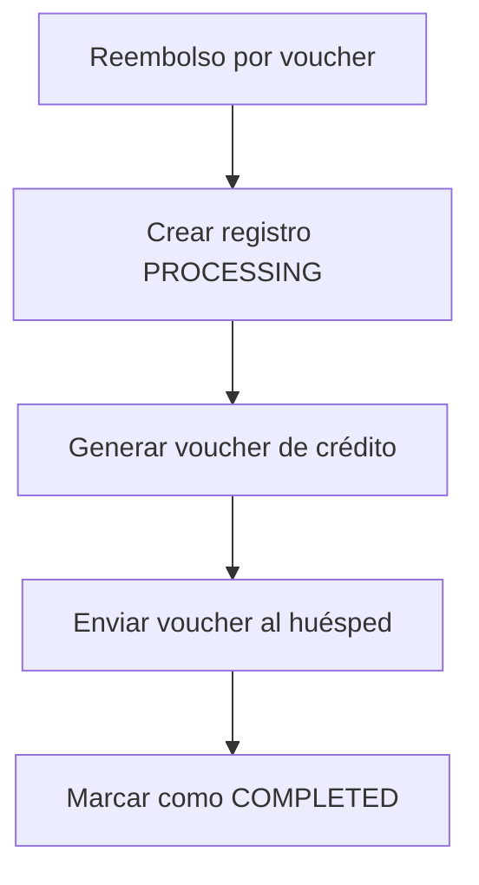
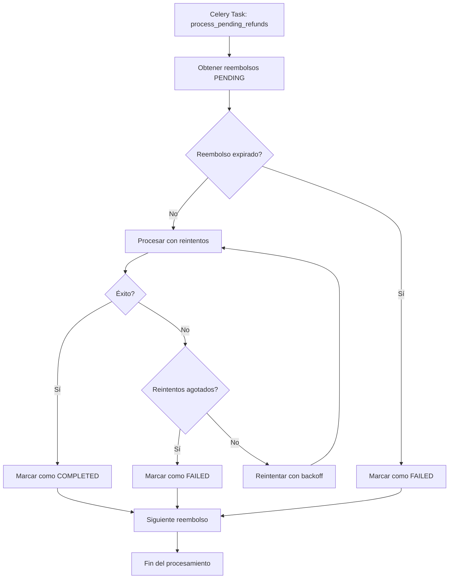
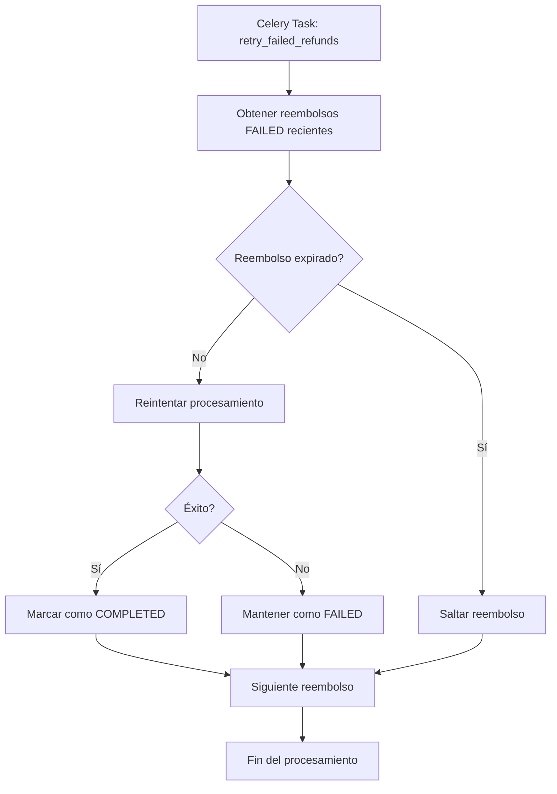

# Flujo de Cancelación y Reembolsos - AlojaSys

## Resumen Ejecutivo

Este documento describe el flujo completo de cancelación de reservas y procesamiento de reembolsos en el sistema AlojaSys. El sistema maneja diferentes escenarios de cancelación basados en políticas configurables por hotel, incluyendo cancelaciones automáticas y manuales.

## Tabla de Contenidos

1. [Arquitectura del Sistema](#arquitectura-del-sistema)
2. [Flujos de Cancelación](#flujos-de-cancelación)
3. [Procesamiento de Reembolsos](#procesamiento-de-reembolsos)
4. [Tareas Automáticas](#tareas-automáticas)
5. [Casos de Uso](#casos-de-uso)
6. [Ejemplos de Payloads](#ejemplos-de-payloads)
7. [Configuración de Políticas](#configuración-de-políticas)

## Arquitectura del Sistema

### Componentes Principales

```
┌─────────────────────────────────────────────────────────────────┐
│                        AlojaSys PMS                            │
├─────────────────────────────────────────────────────────────────┤
│  ┌─────────────────┐  ┌─────────────────┐  ┌─────────────────┐  │
│  │   Reservations  │  │    Payments     │  │  Notifications  │  │
│  │     Module      │  │     Module      │  │     Module      │  │
│  └─────────────────┘  └─────────────────┘  └─────────────────┘  │
│           │                     │                     │         │
│           └─────────────────────┼─────────────────────┘         │
│                                 │                               │
│  ┌─────────────────┐  ┌─────────────────┐  ┌─────────────────┐  │
│  │  Refund         │  │   Celery        │  │   Gateway       │  │
│  │  Processor      │  │   Tasks         │  │   Adapters      │  │
│  └─────────────────┘  └─────────────────┘  └─────────────────┘  │
└─────────────────────────────────────────────────────────────────┘
```

### Modelos de Datos

```
Reservation
├── id (PK)
├── hotel (FK)
├── room (FK)
├── status (PENDING|CONFIRMED|CANCELLED|CHECK_IN|CHECK_OUT|NO_SHOW)
├── check_in (Date)
├── check_out (Date)
├── total_price (Decimal)
├── applied_cancellation_policy (FK)
├── applied_cancellation_snapshot (JSON)
└── payments (Related)

Payment
├── id (PK)
├── reservation (FK)
├── amount (Decimal)
├── method (cash|transfer|pos)
└── date (Date)

PaymentIntent
├── id (PK)
├── reservation (FK)
├── amount (Decimal)
├── status (PENDING|APPROVED|REJECTED)
└── mp_payment_id (String)

Refund
├── id (PK)
├── reservation (FK)
├── payment (FK)
├── amount (Decimal)
├── status (PENDING|PROCESSING|COMPLETED|FAILED)
├── refund_method (credit_card|bank_transfer|cash|voucher)
└── external_reference (String)
```

## Flujos de Cancelación

### 1. Cancelación Manual de Reserva



### 2. Cancelación Automática por Depósito Vencido



### 3. Cancelación Automática por Check-in Vencido



## Procesamiento de Reembolsos

### Flujo Principal de Reembolso



### Métodos de Reembolso

#### 1. Reembolso por Método Original (Tarjeta)



#### 2. Reembolso por Transferencia Bancaria



#### 3. Reembolso en Efectivo



#### 4. Reembolso por Voucher



## Tareas Automáticas

### 1. Procesamiento de Reembolsos Pendientes



### 2. Reintento de Reembolsos Fallidos



## Casos de Uso

### Caso 1: Reserva PENDING Cancelada

**Escenario**: Usuario cancela reserva PENDING sin pagos

**Flujo**:
1. Usuario solicita cancelación
2. Sistema verifica que no hay pagos
3. Cambia estado a CANCELLED
4. Libera habitación
5. No se crea reembolso

**Resultado**: ✅ Cancelación exitosa, sin reembolso

### Caso 2: Reserva CONFIRMED Cancelada Antes del Cutoff

**Escenario**: Usuario cancela reserva CONFIRMED 3 días antes del check-in

**Flujo**:
1. Usuario solicita cancelación
2. Sistema calcula reglas de cancelación
3. Determina cancelación gratuita (48h de anticipación)
4. Calcula reembolso completo
5. Procesa reembolso por tarjeta
6. Cambia estado a CANCELLED
7. Envía notificaciones

**Resultado**: ✅ Reembolso completo procesado

### Caso 3: Reserva CONFIRMED Cancelada Fuera de Ventana

**Escenario**: Usuario cancela reserva CONFIRMED 12 horas antes del check-in

**Flujo**:
1. Usuario solicita cancelación
2. Sistema calcula reglas de cancelación
3. Determina penalidad del 25%
4. Calcula reembolso parcial (75%)
5. Procesa reembolso por transferencia bancaria
6. Cambia estado a CANCELLED
7. Envía notificaciones

**Resultado**: ✅ Reembolso parcial pendiente de procesamiento manual

### Caso 4: Auto-cancelación por Depósito Vencido

**Escenario**: Reserva PENDING sin pago después de 7 días

**Flujo**:
1. Tarea Celery ejecuta auto_cancel_pending_deposits
2. Encuentra reserva con depósito vencido
3. Verifica que no tiene pagos
4. Cambia estado a CANCELLED
5. Libera habitación
6. Envía notificaciones por email
7. Registra log de cancelación automática

**Resultado**: ✅ Cancelación automática exitosa

### Caso 5: Procesamiento de Reembolsos Pendientes

**Escenario**: Sistema procesa reembolsos pendientes cada hora

**Flujo**:
1. Tarea Celery ejecuta process_pending_refunds
2. Obtiene reembolsos PENDING
3. Verifica expiración
4. Procesa con reintentos
5. Actualiza estados
6. Envía notificaciones

**Resultado**: ✅ Reembolsos procesados automáticamente

## Ejemplos de Payloads

### 1. Solicitud de Cancelación

```json
{
  "reservation_id": 123,
  "cancellation_reason": "Cambio de planes",
  "confirm": true
}
```

### 2. Respuesta de Cálculo de Cancelación

```json
{
  "detail": "Cálculo de cancelación completado",
  "action": "calculation",
  "cancellation_rules": {
    "type": "partial",
    "fee_type": "percentage",
    "fee_value": 25.0,
    "message": "Cancelación con penalidad del 25%"
  },
  "refund_rules": {
    "type": "partial",
    "refund_percentage": 75.0,
    "refund_method": "original_payment",
    "processing_days": 7,
    "message": "Devolución del 75% por método original"
  },
  "financial_summary": {
    "total_paid": 500.00,
    "penalty_amount": 125.00,
    "refund_amount": 375.00,
    "net_refund": 375.00
  },
  "reservation": {
    "id": 123,
    "status": "confirmed",
    "check_in": "2024-02-15",
    "check_out": "2024-02-18",
    "total_price": 500.00
  }
}
```

### 3. Respuesta de Cancelación Exitosa

```json
{
  "detail": "Cancelación procesada exitosamente",
  "action": "cancelled",
  "cancellation_rules": {
    "type": "free",
    "fee_type": "none",
    "fee_value": 0.0,
    "message": "Cancelación gratuita"
  },
  "refund_rules": {
    "type": "full",
    "refund_percentage": 100.0,
    "refund_method": "original_payment",
    "processing_days": 7,
    "message": "Devolución completa por método original"
  },
  "financial_summary": {
    "total_paid": 500.00,
    "penalty_amount": 0.00,
    "refund_amount": 500.00,
    "net_refund": 500.00
  },
  "refund_result": {
    "refund_id": 456,
    "method": "credit_card_refund",
    "amount": 500.00,
    "status": "processing",
    "external_reference": "MP_REFUND_789",
    "requires_manual_processing": true
  },
  "reservation": {
    "id": 123,
    "status": "cancelled",
    "check_in": "2024-02-15",
    "check_out": "2024-02-18",
    "total_price": 500.00
  }
}
```

### 4. Notificación de Reembolso

```json
{
  "notification_type": "refund_created",
  "title": "Reembolso Procesado - $375.00",
  "message": "El reembolso para la reserva RES-123 ha sido procesado exitosamente.",
  "hotel_id": 1,
  "reservation_id": 123,
  "metadata": {
    "refund_id": 456,
    "amount": 375.00,
    "method": "credit_card_refund",
    "status": "processing",
    "external_reference": "MP_REFUND_789"
  }
}
```

### 5. Log de Cancelación

```json
{
  "event_type": "cancel",
  "reservation_id": 123,
  "changed_by": null,
  "message": "Cancelación procesada - Total pagado: $500.00 | Penalidad aplicada: $0.00 | Devolución calculada: $500.00 | Método de devolución: credit_card_refund",
  "snapshot": {
    "cancellation_rules": {
      "type": "free",
      "fee_type": "none",
      "fee_value": 0.0
    },
    "refund_rules": {
      "type": "full",
      "refund_percentage": 100.0,
      "refund_method": "original_payment"
    },
    "total_paid": 500.00,
    "penalty_amount": 0.00,
    "refund_amount": 500.00,
    "refund_result": {
      "refund_id": 456,
      "method": "credit_card_refund",
      "amount": 500.00,
      "status": "processing"
    }
  }
}
```

## Configuración de Políticas

### Política de Cancelación

```json
{
  "name": "Política Estándar",
  "is_active": true,
  "is_default": true,
  "free_cancellation_time": 24,
  "free_cancellation_unit": "hours",
  "partial_refund_time": 72,
  "partial_refund_unit": "hours",
  "partial_refund_percentage": 50.0,
  "no_refund_time": 168,
  "no_refund_unit": "hours",
  "cancellation_fee_type": "percentage",
  "cancellation_fee_value": 10.0,
  "allow_cancellation_after_checkin": false,
  "allow_cancellation_after_checkout": false,
  "allow_cancellation_no_show": true,
  "allow_cancellation_early_checkout": false,
  "auto_refund_on_cancel": true
}
```

### Política de Devolución

```json
{
  "name": "Política de Devolución Estándar",
  "is_active": true,
  "is_default": true,
  "full_refund_time": 24,
  "full_refund_unit": "hours",
  "partial_refund_time": 72,
  "partial_refund_unit": "hours",
  "partial_refund_percentage": 50.0,
  "no_refund_time": 168,
  "no_refund_unit": "hours",
  "refund_method": "original_payment",
  "refund_processing_days": 7,
  "voucher_expiry_days": 365,
  "voucher_minimum_amount": 0.0
}
```

### Configuración de Pasarela de Pago

```json
{
  "provider": "mercado_pago",
  "is_test": true,
  "country_code": "AR",
  "currency_code": "ARS",
  "refund_window_days": 30,
  "partial_refunds_allowed": true,
  "public_key": "TEST_PUBLIC_KEY",
  "access_token": "TEST_ACCESS_TOKEN"
}
```

## Configuración de Tareas Celery

### Programación de Tareas

```python
# settings.py
CELERY_BEAT_SCHEDULE = {
    'auto-cancel-pending-deposits': {
        'task': 'apps.reservations.tasks.auto_cancel_pending_deposits',
        'schedule': crontab(hour=2, minute=0),  # Diario a las 2:00 AM
    },
    'auto-cancel-expired-pending': {
        'task': 'apps.reservations.tasks.auto_cancel_expired_pending_reservations',
        'schedule': crontab(hour=3, minute=0),  # Diario a las 3:00 AM
    },
    'process-pending-refunds': {
        'task': 'apps.payments.tasks.process_pending_refunds',
        'schedule': crontab(minute=0),  # Cada hora
    },
    'retry-failed-refunds': {
        'task': 'apps.payments.tasks.retry_failed_refunds',
        'schedule': crontab(hour=4, minute=0),  # Diario a las 4:00 AM
    },
}
```

## Monitoreo y Alertas

### Métricas Clave

- **Tasa de cancelación**: % de reservas canceladas vs. total
- **Tiempo promedio de procesamiento de reembolsos**: Tiempo desde cancelación hasta reembolso
- **Tasa de éxito de reembolsos**: % de reembolsos procesados exitosamente
- **Reembolsos pendientes**: Cantidad de reembolsos en estado PENDING
- **Reembolsos fallidos**: Cantidad de reembolsos en estado FAILED

### Alertas Configuradas

1. **Reembolso fallido**: Notificación inmediata al staff
2. **Reembolso expirado**: Notificación diaria al staff
3. **Auto-cancelación masiva**: Notificación si se cancelan >10 reservas en un día
4. **Error de integración con pasarela**: Notificación inmediata al equipo técnico

## Consideraciones de Seguridad

### Validaciones de Seguridad

1. **Autenticación**: Solo usuarios autenticados pueden cancelar reservas
2. **Autorización**: Verificar que el usuario puede cancelar la reserva específica
3. **Validación de datos**: Validar todos los inputs antes de procesar
4. **Transacciones atómicas**: Usar transacciones de base de datos para operaciones críticas
5. **Logging de auditoría**: Registrar todas las acciones de cancelación y reembolso

### Prevención de Fraude

1. **Límites de tiempo**: Políticas de cancelación basadas en tiempo
2. **Verificación de pagos**: Validar que los pagos existen antes de reembolsar
3. **Monitoreo de patrones**: Detectar patrones sospechosos de cancelación
4. **Validación de identidad**: Verificar identidad del usuario que solicita cancelación

## Troubleshooting

### Problemas Comunes

1. **Reembolso no se procesa**
   - Verificar configuración de pasarela
   - Revisar logs de errores
   - Verificar estado de la reserva

2. **Cancelación automática no funciona**
   - Verificar configuración de políticas
   - Revisar logs de tareas Celery
   - Verificar estado de la base de datos

3. **Notificaciones no se envían**
   - Verificar configuración de email
   - Revisar logs de notificaciones
   - Verificar estado del servicio de notificaciones

### Comandos de Diagnóstico

```bash
# Verificar estado de tareas Celery
celery -A hotel inspect active

# Verificar logs de reembolsos
python manage.py shell -c "from apps.payments.models import Refund; print(Refund.objects.filter(status='pending').count())"

# Verificar reservas pendientes
python manage.py shell -c "from apps.reservations.models import Reservation; print(Reservation.objects.filter(status='pending').count())"
```

## Conclusión

El sistema de cancelación y reembolsos de AlojaSys está diseñado para ser robusto, escalable y fácil de mantener. Utiliza políticas configurables, procesamiento asíncrono con Celery, y múltiples métodos de reembolso para adaptarse a diferentes necesidades de negocio.

La arquitectura modular permite agregar nuevos métodos de pago y reembolso sin afectar el código existente, mientras que el sistema de notificaciones mantiene a todos los stakeholders informados sobre el estado de las operaciones.

